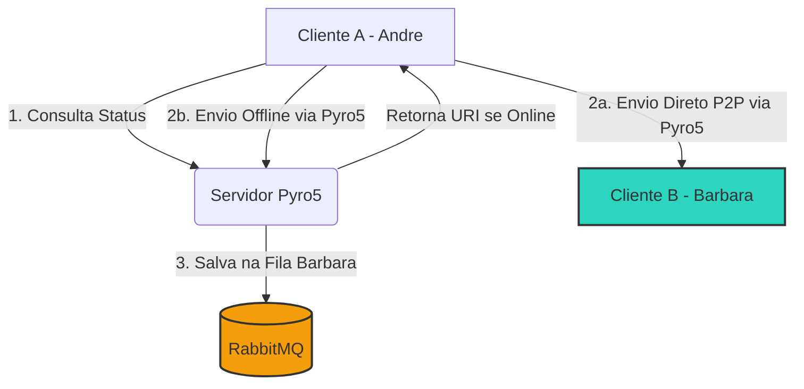

# MessageNet (ChatMSN) — Sistema de Mensagens Híbrido (P2P + Servidor/Broker)

Este projeto é um sistema de chat instantâneo inspirado no clássico MSN Messenger. Ele utiliza uma **arquitetura híbrida** que combina comunicação direta P2P (Peer-to-Peer) entre clientes online com armazenamento de mensagens offline em filas centralizadas através de um servidor e um broker de mensagens.

---

## 1. Tecnologias Utilizadas

*   **Linguagem:** Python 3
*   **Interface Gráfica (GUI):** `customtkinter` (extensão moderna do `tkinter` com suporte a tema escuro e elementos visuais premium)
*   **Comunicação Distribuída & P2P:** `Pyro5` (Python Remote Objects), usado tanto para registrar usuários quanto para a comunicação P2P direta.
*   **Fila de Mensagens Offline (Message Broker):** `RabbitMQ` (executado via Docker), acessado com a biblioteca `pika`.
*   **Persistência de Dados:** Arquivos JSON locais por usuário (ex: `dados_Andre.json`).

---

## 2. Arquitetura e Fluxo de Funcionamento

A aplicação opera sob duas modalidades de comunicação, a depender do status de disponibilidade do contato de destino:



### Cenário A: Comunicação P2P Direta (Ambos Online)
1. O **Cliente A** quer enviar uma mensagem para o **Cliente B**.
2. O **Cliente A** consulta o servidor central (`server.py`) para verificar se o **Cliente B** está online e obter sua **URI Pyro5** (endereço de rede temporário).
3. Se o **Cliente B** estiver online, o **Cliente A** se conecta diretamente à URI do **Cliente B** (sem passar pelo servidor intermediário) e chama o método remoto `receive_message`.
4. O **Cliente B** recebe e exibe a mensagem instantaneamente.

### Cenário B: Envio de Mensagem Offline (Destinatário Offline)
1. O **Cliente A** detecta que o **Cliente B** está offline (ou a tentativa de conexão direta falha).
2. O **Cliente A** envia a mensagem para o servidor central através do método `send_offline_message`.
3. O servidor central recebe a mensagem e a armazena em uma fila durável do **RabbitMQ** associada ao nome do **Cliente B** (ex: fila `barbara`).
4. Quando o **Cliente B** logar novamente (ficar Online), o servidor consome todas as mensagens pendentes da fila do RabbitMQ e as entrega ao **Cliente B**.

---

## 3. Descrição dos Componentes

### A. Servidor Central (`server.py`)
O servidor age como um diretório de contatos online e um gateway para mensagens offline:
*   **Daemon Pyro5:** Fica escutando na porta `9090` e expõe a classe `MessageServer`.
*   **Gerenciamento de Presença:** Mantém o dicionário `online_users` mapeando o nome do cliente para sua URI ativa.
*   **Integração com RabbitMQ:** Utiliza o `pika` para declarar filas duráveis e persistir mensagens offline usando o modo de entrega persistente (`delivery_mode=Persistent`).

### B. Cliente/UI (`UI.py`)
A interface gráfica contém toda a lógica do cliente e gerencia a experiência visual:
*   **Daemon Local:** Ao iniciar, cada cliente abre um daemon Pyro5 próprio em uma porta aleatória, gerando sua própria URI única para receber mensagens P2P.
*   **Polling de Status:** Periodicamente, o cliente faz uma requisição leve ao servidor para checar se seus contatos mudaram de status (Online/Offline) e atualiza a interface em tempo real.
*   **Persistência Local:** Salva o histórico de mensagens e lista de contatos localmente em `dados_<NomeDoUsuario>.json` para não perder conversas ao fechar o app.
*   **Visual Premium:** Customizado com paleta de cores moderna (Slate/Dark), avatares dinâmicos com iniciais, indicadores visuais de mensagem pendente (⏳) e entregue (✓✓).

---

## 4. Como Executar a Aplicação

### Passo 1: Iniciar o RabbitMQ (Docker)
Certifique-se de que o Docker Desktop está aberto e execute o contêiner do RabbitMQ:
```powershell
docker start rabbitmq
```
*(Caso não possua o contêiner criado, crie-o usando: `docker run -d --name rabbitmq -p 5672:5672 -p 15672:15672 rabbitmq:3-management`)*

### Passo 2: Instalar as Dependências (se necessário)
```powershell
pip install Pyro5 pika customtkinter
```

### Passo 3: Iniciar o Servidor
Execute o servidor central em um terminal dedicado:
```powershell
python server.py
```
O servidor imprimirá o IP local em que foi iniciado (ex: `192.168.86.144`).

### Passo 4: Iniciar os Clientes
Abra novos terminais e inicie duas ou mais instâncias do cliente:
```powershell
python UI.py
```
1. Informe seu nome de contato (ex: `Andre` ou `Barbara`).
2. Informe o IP do servidor (o IP impresso no terminal do `server.py`).
3. Adicione o outro contato na lista usando o botão **`+`** e comece a conversar!
